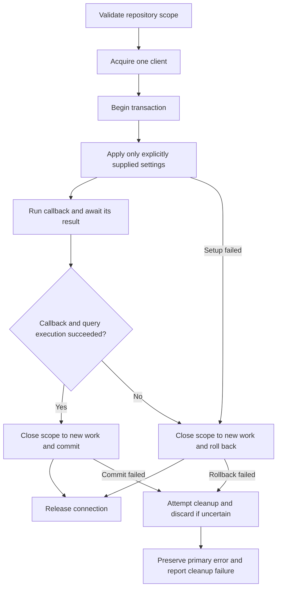

## Recommendation

Keep `initialize({ models, pool: connection })` for existing transaction connections, and add a managed callback for applications that want BigAl to own the transaction lifecycle.
Keep `find().where().select().populate()`, `create(values, options)`, `update(where, values, options)`, and `destroy(where, options)`.
Include opt-in row locking in the initial managed-transaction release, with optional database timeout settings and real concurrency tests.
This is a non-breaking addition: upgrading alone must preserve existing query behavior, including PostgreSQL's normal locking and configured timeouts.
This would remove the need for raw SQL for ordinary transactional CRUD without introducing a new database object, entity manager, schema API, or unit of work.

The underlying pattern already works: `initialize({ models, pool: connection })` creates repositories on a checked-out transaction client.
There is no need for a public `bindRepositories` helper to use those repositories in a transaction.
The proposed `transaction({ pool, repositories }, callback)` adds client acquisition, commit/rollback, cleanup, and typed repositories scoped to that client.
Reusing existing repository metadata can remain an internal implementation detail of that helper.
Write-side `pool` overrides are a complementary bridge for existing helpers, not a prerequisite for repository-scoped transactions.

This is a design proposal, with illustrative API examples and an implementation sequence.
No library implementation is included.
Research reflects the repository at `b4ce8531fb1c595c36afb73553f73e1992a21b21` and official documentation consulted on September 13, 2026.

---

## Goal Capsule

Applications should be able to perform dependent reads and writes atomically using familiar BigAl repository methods.
Existing manually managed transactions should continue using `initialize` with their connection and ordinary repository methods.

The proposal assumes explicit transaction propagation and one PostgreSQL connection per transaction.
Implementation requires a separate decision to proceed; the work authorized here is research and this plan.
Beads holds work status; this document records the proposed design.

---

## Current Capabilities

### Connection routing

`PoolLike` in `src/types/PoolLike.ts` requires only a generic `query()` method.
A checked-out PostgreSQL client can already satisfy that contract.
BigAl does not currently acquire clients or own `BEGIN`, `COMMIT`, or `ROLLBACK`.

Reads accept `pool` in `FindOneArgs`, `FindArgs`, and `CountArgs`.
`ReadonlyRepository` selects the override ahead of `_readonlyPool`.
For example, this is existing syntax when `connection` belongs to an externally managed transaction:

```ts
const product = await productRepository.findOne({ pool: connection }).where({ id: productId }).select(['id', 'name']);
```

An explicit read override already reaches `.populate()`, including the junction and target queries in many-to-many relationships.
The relevant paths are `populateSingleAssociation`, `populateOneManyCollection`, and `populateManyManyCollection` in `src/ReadonlyRepository.ts`.
`tests/readonlyRepository.test.ts` already covers inherited overrides and explicit populate overrides.

Writes are the main missing piece.
`create`, `update`, and `destroy` in `src/Repository.ts` execute against `_pool` directly, and their options do not accept `pool`.
Applications can currently call `initialize({ models, pool: connection })` inside a transaction to construct another repository set.
That works structurally, but repeats initialization and often requires type assertions because `initialize()` returns a broad string-keyed repository map.

This is existing syntax:

```ts
const repos = initialize({
  models: [Product, Store],
  pool: connection,
});
```

The transaction owner checks out `connection` and manages its lifecycle.
The local repositories use that client for writes and, by default, reads.
Calling the ordinary repository methods on this local set replaces most handwritten CRUD SQL today; application typing may require the existing typed-map assertion.
Global repositories still use their original pools.
Models with named connections and all relation dependencies must be configured correctly in this initialization.

Applications can share the existing model list rather than repeat it at each call.
`initialize` rebuilds model and column descriptions and creates new repository instances; an optional `expose` callback also runs again.
No measured performance problem with that work was established during this research.
The managed helper should address repeated lifecycle code and preserve types from already-typed repositories.

### SQL and result behavior worth preserving

BigAl already supports parameterized filters, arrays of IDs, bulk creates, multi-row updates, deletes, returning records, joins, subqueries, and conflict handling.
`OnConflictOptions` supports `action: 'ignore'` and `action: 'merge'`, column targets, partial-index predicates, merge columns, and a merge `where` predicate.
These should remain available inside transactions without another mutation API.
However, `merge.where` has a concrete SQL-generation concern: `getInsertQueryAndParams` passes its predicate into `buildWhereStatement` without a target-table qualification context.
The existing merge tests in `tests/sqlHelper.test.ts` expect unqualified columns such as `WHERE ("other_id" IS NULL OR "other_id"=$4)`.
The supplied usage reports PostgreSQL ambiguity with `EXCLUDED`; local source inspection confirms the unqualified output path, but no database reproduction was run for this plan.
Treat this as a focused correctness fix before recommending conditional merges as a reliable replacement for raw SQL.

Builders are mutable and lazy.
Their `.then()` methods execute SQL; repeated awaits can execute the same builder again.
The transaction helper must await the callback's returned thenable before committing.
It must not assume builders are eager, memoized promises or introduce an array-of-queries API around that assumption.

`FindResult` and `FindOneResult` already preserve selection, population, join, and `toJSON()` types.
Write overloads distinguish single records, arrays, and `returnRecords: false`.
Write `returnSelect` currently limits runtime columns without precisely narrowing the result type; transaction work should preserve that behavior rather than promise a separate typing improvement.

### What transaction support alone cannot replace

| Query need                                                    | Existing capability or remaining gap                                                                                                 |
| ------------------------------------------------------------- | ------------------------------------------------------------------------------------------------------------------------------------ |
| Multi-step reads, creates, updates, and deletes               | Existing repository operations; connection routing is the gap.                                                                       |
| Bulk updates using IDs                                        | Existing array filters and `update()`.                                                                                               |
| Basic conflict ignore or merge                                | Existing `create(..., { onConflict })`.                                                                                              |
| Conditional conflict merge                                    | Existing syntax; qualify target columns in `merge.where` and verify against PostgreSQL.                                              |
| Lock rows before a read-modify-write decision                 | No locking API; add a focused builder extension.                                                                                     |
| Compare an existing row to `EXCLUDED` in a conflict predicate | No general typed column-reference expression API.                                                                                    |
| Set a value only when it is null                              | Often expressible as `update({ value: null }, { value: replacement })`; exact timestamp and other assignment semantics still matter. |
| Advisory locks or specialized SQL                             | Retain a parameterized query escape hatch on the transaction scope.                                                                  |

`docs/advanced/bigal-vs-raw-sql.md` currently lists custom locking among raw SQL use cases.
The proposed work should narrow that guidance to the capabilities that still require SQL.
Moving an operation from raw SQL to repositories also restores model hooks and timestamp/version behavior, so migration must check those semantic differences.

---

## Comparison with Established ORMs

The common pattern is a managed callback with the normal query API bound to one transaction.
The main difference is how that scope reaches each query.

| ORM                             | Transaction style                                                  | Lesson for BigAl                                         |
| ------------------------------- | ------------------------------------------------------------------ | -------------------------------------------------------- |
| [TypeORM][typeorm]              | `dataSource.transaction(callback)`; `manager.withRepository(repo)` | Bind existing repositories.                              |
| [Drizzle][drizzle]              | `db.transaction(async tx => ...)`; fluent queries on `tx`          | Keep query construction familiar.                        |
| [Prisma 7][prisma7]             | `prisma.$transaction(async tx => ...)`; model methods on `tx`      | Support dependent operations and branching.              |
| [Prisma 8][prisma8]             | `db.transaction(async tx => ...)`; ORM access through `tx.orm`     | Preserve the callback; check version-specific features.  |
| [Sequelize 6][sequelize]        | Managed callback plus `{ transaction }`; optional CLS propagation  | Explicit options help; implicit propagation adds policy. |
| [MikroORM 7.2][mikro]           | `em.transactional(...)` with a contextual entity manager           | Its unit of work exceeds BigAl's needs.                  |
| [Knex][knex] / [Kysely][kysely] | Scoped fluent builders; Knex also has `.transacting(trx)`          | Retain the established builder style.                    |

[typeorm]: https://typeorm.io/docs/working-with-entity-manager/custom-repository/
[drizzle]: https://orm.drizzle.team/docs/transactions
[prisma7]: https://www.prisma.io/docs/orm/v7/prisma-client/queries/transactions
[prisma8]: https://docs.prisma.io/docs/orm/fundamentals/transactions
[sequelize]: https://sequelize.org/docs/v6/other-topics/transactions/
[mikro]: https://mikro-orm.io/docs/transactions
[knex]: https://knexjs.org/guide/transactions.html
[kysely]: https://kysely.dev/docs/examples/transactions/simple-transaction

Version distinctions matter.
Prisma 7's array transaction API and isolation/timeout options should not be attributed to Prisma 8.
The [Prisma 8.0 support matrix](https://github.com/prisma/orm/blob/main/scorecard/14-transactions.md) identifies those omissions and no nested savepoints.
Prisma documentation was available through official indexed extracts; the matrix was fetched directly.

Drizzle documents nested transaction callbacks as savepoints.
MikroORM distinguishes nested savepoints from propagation that reuses an existing transaction.
Sequelize 6's nested callback example should not be taken as a guarantee of savepoint behavior.
For BigAl, service composition should first mean passing the existing scope, with savepoints deferred to an explicit later API.

Borrow callback ownership and scoped repositories from these comparisons.
Retain BigAl's existing `pool` option instead of introducing a competing `transaction` option on every method.

---

## Product Contract

### Repository compatibility

- R1. Existing calls retain their SQL, parameters, execution behavior, routing, hooks, results, errors, and TypeScript compatibility when the new features are unused.
- R2. Every CRUD operation accepts an explicit `pool` override, including options containing only `pool`.
- R3. Managed transactions expose ordinary repositories with the caller's chosen keys and each model's existing read/write capabilities.
- R10. Existing transaction owners keep using `initialize({ models, pool: connection })` with its current typing and lifecycle behavior; no additional public binding API is required.

### Transaction behavior

- R4. A managed transaction pins all scoped reads, writes, population queries, and raw queries to one acquired write connection.
- R5. Success commits once; a callback failure or database query failure rolls back, preserves the original error, and releases or discards the connection as appropriate.
- R6. A completed managed scope rejects further execution, and concurrent scopes never modify shared repository connection fields.
- R7. Scoped queries reject conflicting pool overrides and repositories or relationships belonging to another connection configuration.
- R12. Managed transactions apply lock, statement, and idle-in-transaction timeout settings only when explicitly supplied; omitted settings preserve database and driver policy unchanged.

### SQL coverage

- R8. Ordinary dependent CRUD needs no manual SQL; callers retain a parameterized escape hatch for unsupported database operations.
- R9. Only an explicit `.lock(...)` or `lock` option adds a locking clause; new lock validation applies only to queries requesting that feature.
- R11 (separate follow-up, outside this release). Correct conditional conflict predicates to reference the existing target row unambiguously; see U6.

### Compatibility boundaries

Installing the release must not start transactions, add locking SELECT clauses, change isolation levels, set timeouts, or add retries to existing calls.
`initialize`, ordinary CRUD, read-replica routing, named connections, population, and externally managed transactions keep their existing behavior.
Preserve mutable builder behavior and repeated-await execution; the new managed lifetime guard must not become a restriction on ordinary repositories.

Calling the new `transaction` helper explicitly opts into one-client routing and its documented lifecycle and failure handling.
It does not turn normal reads into locking reads or supply a timeout policy when options are omitted.
Calling `.lock(...)` opts only that query into the requested locking mode and wait behavior; population receives no implicit locking clause.
Existing `distinctOn`, count, window, join, and JSON queries remain valid unless combined with the new lock option in an unsupported way.
Scope-membership and closed-transaction checks apply to the new managed executor, not arbitrary existing `PoolLike` clients.

Compatibility covers unchanged callers on upgrade.
An application that explicitly introduces a locking query can still make concurrent writers wait under PostgreSQL's normal rules; an additive API cannot remove that interaction.

### Scope boundaries

Document current transaction-local initialization as the external-owner path.
Add the managed callback with internal repository construction; write overrides can ship independently when per-operation helper compatibility is needed.
Row locking ships with the initial managed-transaction API; it remains a separate implementation unit for review and verification.
The conditional-upsert correction changes existing generated SQL, so it is excluded from this additive release and remains a separately reviewed bug fix.

Deferred extensions include savepoints, ambient `AsyncLocalStorage` propagation, automatic retries, shared-lock modes, general SQL expressions, and stronger write-selection inference.
Transaction-aware hook contexts are also deferred.
Distributed transactions, schema redesign, and a unit of work are outside this proposal.
External service calls and writes through unrelated repositories are outside the transaction's atomicity guarantee.

---

## Proposed Syntax

Except for the existing `initialize` example, examples below show proposed API usage, not implemented features.
Repository variables are assumed to have their existing concrete model types.

### Existing transaction owners: use initialize

```ts
const repos = initialize({
  models: [Product, Store],
  pool: connection,
});
```

This works today and supplies transaction-local repositories for ordinary reads and writes.
Reuse the application's shared model list and existing repository typing wrapper or assertion, if it has one.
The initializer itself still returns a broadly typed map; this proposal does not claim otherwise.
It does not acquire, begin, commit, roll back, or release anything.
The transaction owner remains responsible for its lifetime and for supplying a client connected to the appropriate database.
Query-only `PoolLike` cannot attest client provenance or observe the owner's eventual commit.
Repositories created this way cannot invalidate themselves when that external transaction ends.

Include the models needed by relationships and junctions, and direct every relevant named connection to the same transaction client.
Do not carry a read-replica pool into this initialization; reads must use the transaction client too.
If using `expose`, keep its assignments local rather than replacing shared application repositories.

Taking an existing repository map could preserve its types and avoid rebuilding model descriptions, but neither benefit requires another public helper for this proposal.
Keep that reuse inside the managed helper; improving `initialize` inference can be evaluated separately if its existing typing becomes the adoption obstacle.

### Optional bridge: extend the established per-operation pool option

```ts
await productRepository.create({ name: 'Widget', store: storeId }, { pool: connection });

await productRepository.update({ id: productId }, { name: 'Renamed widget' }, { pool: connection, returnRecords: false });

await productRepository.destroy({ id: obsoleteProductIds }, { pool: connection });
```

The caller still owns the transaction lifecycle for these examples.
Passing a pool or client does not itself start a transaction.
All statements must use the same checked-out client, as the [node-postgres transaction documentation](https://node-postgres.com/features/transactions) requires.

Preserve default return behavior: pool-only create returns one entity or an array according to its input, pool-only update returns an array, and pool-only destroy returns no records.
Do not require a meaningless `returnSelect` or `returnRecords` option just to choose a connection.

### BigAl-managed transactions: query normally inside the callback

```ts
const repositories = {
  Product: productRepository,
  Store: storeRepository,
};

const product = await transaction({ pool, repositories }, async (transaction) => {
  const { Product, Store } = transaction.repositories;
  const store = await Store.create({ name: 'Warehouse' });

  return Product.create({ name: 'Widget', store: store.id });
});
```

Use a standalone exported helper, consistent with `initialize(options)` and helpers such as `subquery(repository)`.
`initialize()` continues returning repositories; no additional methods are attached to its string-keyed map.
The callback context has `repositories` and a guarded `query()` method compatible with `PoolLike`.
It does not expose `commit`, `rollback`, `release`, or the underlying client.

Keeping repositories under one property prevents a model key such as `query` from colliding with transaction operations.
The callback result is inferred and returned only after successful commit.
Choose this helper when BigAl should acquire the client and handle success, failure, explicitly requested timeouts, and cleanup.
An application that already owns that lifecycle can keep the `initialize` example above.

### Reuse helpers and retain an SQL escape hatch

```ts
await transaction({ pool, repositories }, async (transaction) => {
  await transaction.query('SELECT pg_advisory_xact_lock($1::bigint)', [resourceKey]);

  await renameProduct(transaction.repositories.Product, productId, newName);
  await auditRepository.create(auditValues, { pool: transaction });
});
```

Here `renameProduct` accepts the ordinary typed repository it needs.
For helpers already accepting a `PoolLike`, the transaction itself supplies guarded query execution.
The audit example requires the audit repository to belong to the same connection configuration; managed override validation applies to it too.
Calling a helper that captures a global repository does not implicitly enlist its queries.

Application side effects belong after the outer transaction promise resolves, or in an outbox written through the transaction if durable delivery is needed.

### Keep existing upsert syntax inside the scope

```ts
await transaction.repositories.Product.create(
  { id: productId, name: replacementName, store: storeId },
  {
    returnRecords: false,
    onConflict: {
      action: 'merge',
      targets: ['id'],
      merge: { columns: ['name'] },
    },
  },
);
```

The `onConflict` structure and this ordinary merge example are already supported; transaction support preserves their existing SQL and behavior.
Conditional merges using `merge.where` retain their current behavior in this release; the reported qualification issue remains the separate U6 follow-up.
Use `returnRecords: false` when no returned row is an expected outcome of conflict handling.
Single-record `create()` with default returning behavior throws if PostgreSQL returns no row, including when a conflict predicate declines the update.
After U6 is separately verified, some predicates expressed in raw SQL using `EXCLUDED` may instead compare against a known input value.
General existing-column versus incoming-column comparisons still need an expression extension or raw SQL.
Use SQL when exact database-clock behavior or computed assignments cannot be preserved by a conditional repository update.
No new `.upsert()` vocabulary is needed for the supported cases.

### Locking reads: add a normal builder modifier

Use a locking read when a decision spans multiple queries and an atomic conditional update or database constraint cannot express the invariant.
For example, serialize product creation against a store's capacity by locking the existing store before counting its products:

```ts
await transaction({ pool, repositories, lockTimeoutMs: 2_000, statementTimeoutMs: 5_000 }, async (transaction) => {
  const { Product, Store } = transaction.repositories;
  const store = await Store.findOne().where({ id: storeId }).lock('noKeyUpdate');
  if (!store) throw new Error('Store not found');

  const productCount = await Product.count({ where: { store: store.id } });
  if (productCount >= capacity) throw new Error('Store capacity reached');

  return Product.create({ name: 'Widget', store: store.id });
});
```

This example assumes PostgreSQL READ COMMITTED and that every path adding or moving products into the store takes the same parent lock first.
Its timeout values are explicit application choices; omitting them retains the connection's existing settings.
The count runs after the lock is acquired, so it can see the preceding writer's commit.
A different isolation level needs its own snapshot and retry analysis; the lock alone does not refresh a REPEATABLE READ snapshot.
The parent lock coordinates participating writers; it does not automatically prevent arbitrary inserts into the product table.
For a single status transition, prefer `update({ id, status: expectedStatus }, { status: nextStatus })` and check returned rows instead of first selecting with a lock.
PostgreSQL rechecks the update predicate after waiting for a concurrent writer at READ COMMITTED. [Transaction isolation](https://www.postgresql.org/docs/current/transaction-iso.html).

Offer equivalent options syntax, following existing `.sort()`/`sort` and `.where()`/`where` conventions:

```ts
await productRepository.find({
  pool: connection,
  where: { id: productIds },
  lock: { mode: 'update', wait: 'nowait' },
});
```

Initially expose `'update'` and `'noKeyUpdate'`; defer shared-lock modes until a concrete use case requires them.
Use `'noKeyUpdate'` to coordinate ordinary non-key changes with less interference with foreign-key checks; use `'update'` when deletion or referenced-key changes need protection.
The caller chooses the mode explicitly; BigAl does not guess or silently downgrade it.
When `wait` is omitted, PostgreSQL uses its normal waiting behavior, subject to existing settings or explicitly requested transaction timeouts.
Optional `wait` is `'nowait'` or `'skipLocked'`; neither is enabled automatically.
The builder equivalent is `.lock('update', { wait: 'nowait' })`.
A union for wait behavior avoids contradictory `nowait: true` and `skipLocked: true` flags.

Lock only the base entity's rows in the first version, including when a join filters them.
Generate `OF` using the actual visible base-table name or alias, not a schema-qualified expression copied from a SELECT column.
Population uses the same transaction but does not recursively lock related records.
Only when a lock is explicitly requested, reject combinations with `distinctOn`, `withCount`/`findWithCount`, or other unsupported result shapes before execution.
Preserve those checks regardless of builder call order and after `toJSON()`.

Require a managed scope or an explicit client override for locking reads.
For externally managed clients, the caller remains responsible for an active transaction; a structural `PoolLike` cannot prove that one exists.
Locks last only as long as that transaction.
External initialization and explicit client overrides retain the owner's timeout policy; they do not silently change session settings.
`skipLocked` is intended for work queues, not general consistent reads; these limits follow [PostgreSQL's locking clause](https://www.postgresql.org/docs/current/sql-select.html#SQL-FOR-UPDATE-SHARE).

### Locking discipline

Ordinary writes already acquire row locks.
Explicit locking adds a protected read/decision interval; its main risks are longer waits and inconsistent lock ordering.
Row locks normally allow plain SELECT queries to continue, and PostgreSQL releases them when the transaction ends.
PostgreSQL detects deadlocks and aborts a participant; applications still have to handle the failure. [Explicit locking](https://www.postgresql.org/docs/current/explicit-locking.html).

Keep the protected interval short and wholly within one transaction.
Perform network requests, slow computation, and user interaction outside it, then revalidate relevant state after acquiring the lock.
Acquire multiple resources in an agreed table order and stable primary-key order, sequentially rather than through `Promise.all`.
Sorting a JavaScript list used by `WHERE id IN (...)` does not establish database lock order; use an ordered locking SELECT or explicit sequential acquisitions.
Triggers, foreign keys, and other write paths can still introduce deadlocks, so this convention reduces risk without eliminating it.

A locking query only protects rows it actually locks.
No matching row means no row lock: use a unique constraint with conflict handling for create-if-absent, or coordinate through an existing parent row.
Locks do not automatically protect changing result sets, related rows, or a business invariant spanning several tables.
Use constraints first; consider SERIALIZABLE with application-owned retries when the invariant cannot be covered by a small, consistent locking protocol.
TypeScript can validate lock options but cannot prove that every participating writer follows that protocol.

After a wait timeout or deadlock, roll back and return the original error.
Do not retry only the failed statement in an aborted transaction or automatically replay callbacks that may have external effects.
Applications may retry the whole transaction when the operation is safe to repeat, with a bounded retry policy.

---

## Planning Contract

### KTD1. Separate query execution from connection ownership

Keep `PoolLike` query-only.
Introduce a separate connect-capable contract for the managed helper; normal initialization and per-query overrides continue accepting query-only executors.
Initially target checked-out clients from `postgres-pool`, `pg`, and compatible Neon WebSocket pools.
Do not imply support for interactive transactions over an HTTP batch-only executor.

The owned connection contract needs awaited normal release and explicit discard on an unusable connection.
The installed `postgres-pool` exposes asynchronous `release(removeConnection?: boolean)`; node-postgres documents a release argument for destroying a client.
Verify the shared contract against actual driver declarations during implementation, and adapt incompatible drivers at this boundary.
Do not guess release behavior from the presence of a `.query()` method.
See [postgres-pool](https://github.com/postgres-pool/postgres-pool) and [node-postgres pooling](https://node-postgres.com/apis/pool).

Allow an optional `isolationLevel` in managed options using a finite union of supported PostgreSQL levels.
When omitted, retain the database default; apply an explicit level before invoking the callback.
Connection acquisition timeouts remain driver configuration in the first release.
No automatic retries or callback timeout implemented with a detached `Promise.race`.

### KTD5. Make transaction-local timeout settings opt-in

Implement R12 as optional transaction-local PostgreSQL settings applied after BEGIN and before the callback.
`lockTimeoutMs`, `statementTimeoutMs`, and `idleInTransactionTimeoutMs` have no BigAl defaults.
When an option is omitted, leave that setting untouched, including an existing unlimited setting; do not emit configuration SQL for it.
Accept nonnegative integer values within PostgreSQL's supported range; an explicit zero disables that timeout for this transaction according to PostgreSQL semantics.
Reject negative, non-integer, or out-of-range supplied values before acquiring the client.
Recommend finite values in examples for operations that need them, without enabling those values through initialization, repository construction, or `.lock()`.

An enabled `lockTimeoutMs` bounds each lock acquisition, including implicit write locks throughout that transaction, not just an explicit locking SELECT.
An enabled `statementTimeoutMs` bounds a complete statement, covering repeated lock waits and query execution.
An enabled `idleInTransactionTimeoutMs` terminates a connection that remains idle inside the transaction, limiting abandoned or stalled callback holds.
The first two abort a statement; the idle limit closes the session and requires the client to be discarded.
These meanings follow [PostgreSQL's client timeouts](https://www.postgresql.org/docs/current/runtime-config-client.html).

Use transaction-local settings so successful release cannot leak timeout changes into the next pool borrower. [SET LOCAL](https://www.postgresql.org/docs/current/sql-set.html).
Parameterize setting values through an appropriate PostgreSQL configuration function or validate and format them through the SQL layer.
If setup fails, fail the transaction before running application code.
These settings do not impose a total transaction deadline or stop JavaScript already running after a connection is terminated.
Keep external effects outside the callback, and let the existing execution guard reject subsequent database work.

Preserve SQLSTATE `55P03` for lock unavailability/timeouts, `40P01` for deadlocks, `40001` for serialization failures, and `57014` for query cancellation.
Classify using the original error code rather than message text; a code alone need not distinguish every cancellation cause. [PostgreSQL error codes](https://www.postgresql.org/docs/current/errcodes-appendix.html).
Do not mask one of these failures with a secondary rollback error.

### KTD2. Build isolated scopes from existing metadata

Inside `transaction`, construct fresh built-in repositories using the existing instances' model descriptions and relation registry, with the guarded client as their executor.
Share repository construction with `initialize` where practical, keeping this operation private.
The managed helper must not rerun `expose` or rediscover decorators because it accepts repositories already configured by the application.
This preserves those repositories' configuration; it does not establish a performance requirement to replace external calls to `initialize`.
Never temporarily swap `_pool` or `_readonlyPool` on shared repositories.

Use one guarded executor as the effective pool for every scoped operation, including population and implicit junction repositories.
Preserve the complete metadata registry needed by those relationships even when the public repository map contains only selected entries.
Validate connection membership before forwarding a transaction executor to any repository, including the explicit `{ pool: transaction }` path.

Use source write-pool identity plus the initialization connection configuration as the conservative membership boundary.
Equivalent connection strings alone do not establish membership.
Reject mixed-connection public maps before acquiring a client, and reject cross-connection relation traversal before issuing its SQL.
Schema differences within the same connection are allowed.
These checks apply to the managed helper; external calls to `initialize` retain the configuration and client-lifetime responsibilities described under Proposed Syntax.

Support the standard `Repository` and `ReadonlyRepository` implementations initially.
Do not silently reconstruct custom subclasses or wrappers as base repositories while retaining their custom TypeScript types.
Reject unsupported custom implementations clearly; those consumers can adopt per-operation overrides until an explicit binding extension is designed.

### KTD3. Make transaction lifetime a runtime contract



Guard execution when a builder is awaited, rather than only when it is constructed.
A saved repository, raw-query method, or lazy builder must fail after completion without reaching a released connection.
Directly returning a builder is supported through thenable assimilation; hiding unawaited builders inside an object is not automatic execution.

Track database query failures on the scope even when application code catches them.
Without savepoints, a PostgreSQL statement error can leave the transaction aborted; a resolved callback must not be reported as committed in that state.
Preserve the original database error, including its SQLSTATE.

On failure, prevent new work and settle already-started operations before rollback and release.
Include BigAl's internal concurrent population branches, and cover the pre-query hook interval so a pending operation cannot resume on a released client.
On success, a callback that leaves started operations pending should fail clearly rather than commit while work is still outstanding.
An unstarted lazy builder cannot be discovered automatically; its later execution is rejected by the closed-scope guard.

Acquisition failures have no client to release; begin failures still require cleanup of any acquired client.
Rollback or release errors must not replace an earlier callback/query error.
A commit transport failure may leave the outcome unknown; report uncertainty and never retry the callback automatically.
A release failure after an acknowledged commit must be reported as cleanup failure after commit, not as a rollback.

### KTD4. Preserve explicit composition and existing hooks

Passing scoped repositories into another helper reuses the transaction.
Do not expose a nested transaction method initially; reject a managed helper invoked with already-scoped repositories or a transaction executor as its source.
A new top-level transaction started on an ordinary pool is independent, even if lexically inside another callback.
Without ambient state, BigAl cannot detect every such call or a helper's use of global repositories.

Keep `Entity.beforeCreate(values)` and `Entity.beforeUpdate(values)` running as today.
They transform values and currently receive no transaction context.
Globally captured repository calls inside a hook do not become transactional automatically.
Do not change hook signatures or imply an after-commit mechanism in this release.

---

## TypeScript Approach

Use generics and mapped types to preserve the types callers already have.
No schema rewrite or advanced lifetime type system is needed.

The conceptual type relationships are:

```text
Caller repository map
  -> Same keys, each mapped to its typed standard read/write repository
Callback result
  -> Promise<Awaited<Result>>
Lock wait option
  -> Omitted | 'nowait' | 'skipLocked'
```

- Preserve the model generic and writable/read-only distinction for each map value; check writable repositories before their read-only supertype in conditional mappings.
- Reuse existing overloaded repository interfaces and query-result types rather than recreating every method using `Parameters` and `ReturnType`.
- Infer callback results, including `void`, arrays, selected reads, populated reads, and directly returned `PromiseLike` builders.
- Accept an explicitly keyed, already-typed repository map; a `const` type parameter can retain literal information where needed without requiring consumer assertions.
- Align the optional arguments on `IReadonlyRepository.find()` and `.findOne()` with the existing implementations so the proposed `.find()` examples work through interface types.

These mechanisms follow TypeScript's [mapped types](https://www.typescriptlang.org/docs/handbook/2/mapped-types.html) and [utility types](https://www.typescriptlang.org/docs/handbook/utility-types.html).
An ordinary generic already preserves object keys in many cases; use `const` inference only where it demonstrably improves the public API.

Do not promise that `initialize({ models: [Product] })` can infer a literal `Product` key and readonly decorator state from constructor names alone.
Those are runtime metadata in today's design.
A transaction helper also cannot recover types already erased to `Entity` by its input map.
Improving initialization inference is separate work and is not a prerequisite for consumers with existing typed repositories.

TypeScript cannot enforce connection identity, active database state, or callback lifetimes.
Runtime guards remain necessary, even with branded transaction types.
Avoid adding a transaction-state generic to every builder solely to suggest a guarantee the language cannot enforce.

---

## Implementation Units

### U5. Construct managed repositories internally

**Requirements:** R1, R3. **Dependencies:** part of U2; no standalone public API or release.

**Files:** an internal helper under `src/` if needed, `src/index.ts`, `src/ReadonlyRepository.ts`, `src/Repository.ts`, and `src/IReadonlyRepository.ts`.
Proposed tests: repository-construction cases in `tests/transaction.test.ts`, `tests/transactionTypes.test.ts`, and relation cases in `tests/readonlyRepository.test.ts`.

Reuse the existing repository constructor pattern inside the managed helper, following KTD2.
Preserve typed map keys and read/write capabilities, and carry the effective client into all relationship reads.
Keep `initialize({ models, pool: connection })` working as today; do not add a public binding export or metadata cache as a prerequisite.

**Validation scenarios:**

- Local reads and writes use the supplied executor while original repositories retain their original pools.
- Relation and implicit junction queries inherit the binding even when omitted from the public map.
- Mixed source connections and unsupported repository implementations fail without silent rebinding.
- Internal repository construction does not run lifecycle SQL, release the client, rerun `expose`, or rediscover decorators.
- A typed public map retains ordinary CRUD and selection inference without a consumer cast.

### U1. Add write pool overrides without changing returns

**Requirements:** R1, R2. **Dependencies:** none.

**Files:** `src/Repository.ts`, `src/IRepository.ts`, write option types under `src/query/`, and `tests/repository.test.ts`.

Extend all public overloads with optional execution options and route writes through the selected executor.
Keep pool-only options distinct from options that explicitly suppress or request returned records.
Cover concrete classes and public interfaces so overload resolution does not fall back to broad unions.

**Validation scenarios:**

- Single and bulk creates with only `pool` use the supplied executor and retain single/array return types.
- Update and destroy pool-only options retain their respective array/void defaults.
- `returnSelect`, `returnRecords: false`, conflict ignore/merge, and `.toJSON()` remain compatible with the override.
- Hooks, timestamp/version handling, error propagation, and default-pool behavior remain unchanged.

### U2. Add the managed lifetime and repository scope

**Requirements:** R1, R3-R8, R12. **Dependencies:** includes the internal U5 work; U1 only for optional per-operation override examples.

**Files:** new transaction module and connection-capability types under `src/`; exports in `src/index.ts` and `src/types/index.ts`.
Also `src/ReadonlyRepository.ts`, `src/Repository.ts`, `src/IReadonlyRepository.ts`, and relation execution paths.
Proposed tests: `tests/transaction.test.ts`, `tests/transaction.integration.test.ts`, plus existing repository tests.

Implement KTD1-KTD5 with one owned client and a shared execution guard.
Reuse metadata and population behavior; include private junction repositories and membership checks at the execution boundary.
Keep SQL lifecycle construction parameter-safe, using allowlisted isolation values rather than interpolating arbitrary strings.

**Validation scenarios:**

- Commit dependent creates and return their callback result; roll back all writes on a later callback or SQL failure.
- Caught statement failures still prevent successful completion; rollback failure discards the client and preserves the primary error.
- Acquire, begin, commit, rollback, and release failures follow KTD3, including uncertain commit outcomes.
- Read-your-writes works with a configured read replica, ordinary population, and a many-to-many junction omitted from the public scope map.
- Conflicting overrides, mismatched named connections, and custom repository implementations fail clearly before their SQL runs.
- Concurrent transactions and unscoped queries retain their own clients; saved builders and raw methods fail after scope completion.
- Pending hook/population work cannot access a released client; directly returned thenables complete before commit.
- Helpers reuse scoped repositories, and detected attempts to start another managed transaction from that scope are rejected.
- Omitted timeouts produce no timeout-setting SQL and preserve inherited values, including zero; setting one option leaves the others untouched.
- Explicit timeout values are validated, and transaction-local settings do not leak after commit, rollback, or setup failure.
- Statement and idle-in-transaction timeouts preserve the primary failure; a terminated idle client is discarded and later callback queries cannot reach it.

### U3. Add row locking to existing reads

**Requirements:** R1, R9, R12. **Dependencies:** U2 for managed lifetime and optional timeout support; no new write API required.

**Files:** `src/SqlHelper.ts`, `src/ReadonlyRepository.ts`, `src/query/FindOneArgs.ts`, read result interfaces under `src/query/`.
Tests: `tests/sqlHelper.test.ts`, `tests/readonlyRepository.test.ts`, and `tests/transaction.integration.test.ts`.

Follow existing modifier mutation and option parsing conventions.
Keep lock generation in `SqlHelper`; use the SQL rules and limitations specified under Proposed Syntax.

**Validation scenarios:**

- Options and fluent forms generate each allowed mode and wait policy without altering selected/populated result types.
- Queries without a lock option retain their exact SQL and parameters, acquire no additional explicit locks, and do not trigger new lock validation or timeout-setting SQL.
- An ordinary read inside the new managed helper remains an ordinary SELECT; a lock on another query or repository does not affect its generated SQL.
- Two real connections demonstrate waiting, `nowait` failure, and queue-style `skipLocked` behavior.
- A lock wait exceeds its configured limit and causes rollback with the original SQLSTATE, without leaving a usable scoped connection.
- A deliberately inverted two-row acquisition produces a detected deadlock; the victim rolls back and the other transaction can complete.
- Competing capacity checks follow the same parent-lock protocol at READ COMMITTED and cannot both consume the last available slot.
- A failed lookup is not treated as a lock on a missing row; plain reads can proceed while a row is locked.
- Base-table locks with joins and schema-qualified models use the correct `OF` reference; population does not inherit a lock clause.
- Incompatible count/window/distinct combinations fail only with an explicit lock, for both modifier orders and JSON result variants; their existing unlocked forms still pass.
- Locks release after commit and rollback; ordinary unscoped reads without an explicit client cannot silently request transaction locks.

### U6. Separate follow-up: conditional-upsert column qualification

**Related finding:** R11. **Scope:** excluded from the transaction and locking release; tracked separately in `bigal-7xb`.

**Files:** `src/SqlHelper.ts`, `tests/sqlHelper.test.ts`, and a PostgreSQL regression case in `tests/transaction.integration.test.ts`.

Leave existing upsert SQL unchanged in the additive release.
For the separate bug fix, start by reproducing the reported ambiguous merge predicate against PostgreSQL and review its compatibility independently.
Introduce an explicit target-row qualification context for the conflict action's `WHERE` clause; do not simulate a join to obtain a prefix.
Keep INSERT column lists and the left side of `DO UPDATE SET` unqualified.
Preserve the distinct context of partial-index target predicates and the existing `EXCLUDED` assignments.
These scopes differ in [PostgreSQL's INSERT grammar](https://www.postgresql.org/docs/current/sql-insert.html).

**Validation scenarios:**

- A conflict merge with scalar, null, and OR predicates executes without ambiguous target-column errors.
- Qualifying predicates select the existing row; true predicates update and false predicates leave it unchanged through a repository call with `returnRecords: false`.
- Schemas, renamed columns, and existing conflict-target predicates retain their intended SQL.
- Plain creates, unconditional merges, and conflict-ignore queries remain compatible.

### U4. Prove public types and document adoption

**Requirements:** R1-R10, R12. **Dependencies:** accompany each in-scope unit; U2 and U3 for complete coverage. U6 is outside this release.

**Files:** `tests/typeVariance.test.ts`, proposed `tests/transactionTypes.test.ts`, and proposed `docs/guide/transactions.md`.
Update `docs/reference/configuration.md`, `docs/reference/api.md`, `docs/guide/querying.md`, `docs/guide/crud-operations.md`, `docs/advanced/bigal-vs-raw-sql.md`, and `skills/using-bigal/SKILL.md`.
Add the transaction guide to `docs/.vitepress/config.ts` navigation.

Document both adoption paths and the boundary around helpers, hooks, external effects, and specialized SQL.
Use existing repository syntax throughout.
Capture the non-obvious traps in the shared transaction guide: read-replica bypass, relation routing, lazy execution, failed connection cleanup, and locking protocol limits.

**Validation scenarios:**

- Public examples type-check without new consumer casts when given typed repositories.
- Existing calls retain overload resolution and public type assignability; avoid adding required members to existing consumer-implemented interfaces solely to expose `.lock()`.
- The external `initialize` example retains existing typing requirements and routes reads, writes, and required relationships through the supplied client.
- Writable and read-only maps retain capabilities, custom keys remain known, and invalid model properties fail compilation.
- Selections, population, joins, JSON conversion, callback results, and single/bulk/void mutations retain existing inference.
- Type checks do not claim to restore types from broad initialization results or preserve unsupported custom subclasses.
- Driver compatibility fixtures accept supported real pool/client types and reject query-only executors as managed transaction sources.

---

## Verification Contract

Use existing mock-pool tests for routing, generated SQL, overload behavior, and failure injection.
Keep existing expectations intact and add regression cases for calls that do not opt into the new APIs.
Compare SQL and parameters, pool selection, hooks, returns, errors, and mutable/lazy builder behavior against the current implementation.
Cover initialized transaction clients, read replicas, named connections, custom repository implementations, population, and existing conflict options.
Do not update an existing expectation merely to accommodate a behavior change introduced by this feature.
Mock-pool tests do not prove rollback, lock lifetime, visibility, or concurrent transaction isolation.
Add a real PostgreSQL integration fixture with two independent connections and deterministic synchronization for those guarantees.
Use observed lock waits or explicit synchronization barriers for contention tests; avoid correctness assertions based only on short sleeps.
Give timeout/deadlock tests generous harness deadlines distinct from the database limits they exercise.
Inspect the current test/CI setup before adding that fixture; no integration infrastructure was established or run during planning.

Implementation gates are `pnpm run check:types`, `pnpm test`, `pnpm run lint`, and `pnpm run build`, plus the new PostgreSQL integration suite.
Verify actual driver declaration compatibility instead of relying solely on structural mock objects.
Do not add runtime experiments or library changes to this planning revision.

---

## Definition of Done

Ordinary multi-repository transactions use the existing BigAl CRUD API without manual query strings.
Upgrading without adopting the new APIs preserves existing runtime and TypeScript behavior, with unchanged SQL and no automatic locks or timeout settings.
Both external transaction owners and the managed callback path have documented syntax and preserved return types.
External initialization clearly retains caller-owned lifecycle responsibilities and its existing return-type limitations.
Real PostgreSQL tests prove commit/rollback, read-your-writes, relation routing, locking, and concurrent scope isolation.
The initial managed-transaction release includes opt-in row locking and optional timeout settings, and proves timeout cleanup, deadlock recovery, and the documented parent-lock protocol.
Failure tests prove that completed or damaged transaction connections cannot be reused through saved scopes.
The documentation identifies which specialized SQL still needs the escape hatch and which application effects remain outside the transaction.

Document the existing initialization pattern first, then implement U2 with the private repository construction in U5.
Include U3 with U2 in the first managed-transaction release; keep U6 out of that release and review it separately.
U1 is an optional parallel improvement for per-operation integration, with U4 documentation and type coverage accompanying each release.

Implementation follow-up: `bigal-asa`. Conditional-upsert correctness follow-up: `bigal-7xb`.
